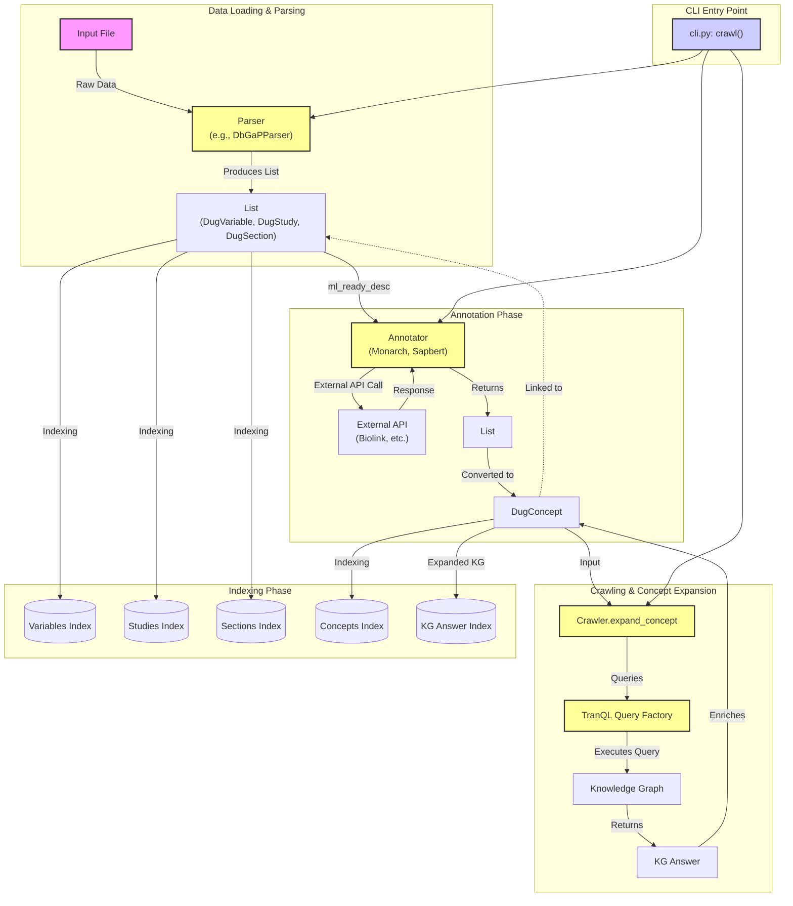

# CLI Tool Architecture

The following diagram illustrates the architecture of the CLI tool, detailing the flow of data through Parsing, Annotation, Crawling (Concept Expansion), and Indexing.

## Data Models
- **DugElement**: Base class for searchable items.
  - **DugVariable**: Represents a variable (e.g., from DbGaP).
  - **DugStudy**: Represents a study.
  - **DugSection**: Represents a section/CRF.
  - **DugConcept**: Represents a standardized concept (e.g., a disease or gene term).
- **DugIdentifier**: Represents a raw identifier returned by an external annotator (e.g., Monarch, Sapbert).

## Architecture Diagram

## Detailed Data Flow

1.  **Parsing**: The `Parser` reads the input file (xml, csv, etc.) and instantiates `DugElement` objects (specifically `DugVariable`, `DugStudy`, or `DugSection`).
2.  **Annotation**: The `Annotator` takes the `ml_ready_desc` (description text) from each `DugElement` and queries an external service (like Monarch). It returns `DugIdentifier` objects. These `DugIdentifier` objects are used to create `DugConcept` objects, which are then linked to the original `DugElement`.
3.  **Crawling (Concept Expansion)**: The `Crawler` iterates through the unique `DugConcept` objects. It uses `TranQL` to execute queries against a broader Knowledge Graph (KG) to find related concepts and "answers". These answers are stored within the `DugConcept`.
4.  **Indexing**:
    -   `DugElement` objects are indexed into their respective Elasticsearch indices (`variables_index`, `studies_index`, `sections_index`).
    -   `DugConcept` objects are indexed into the `concepts_index`.
    -   The Knowledge Graph answers found during expansion are indexed into the `kg_index`.
